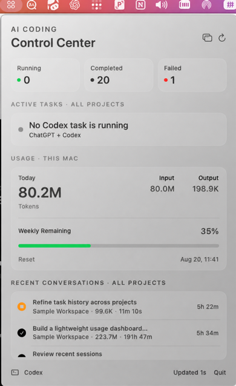

# AI Coding Status Bar

一个轻量的 macOS Codex 状态栏工具，用来查看本机正在运行的任务、最近对话和 Token Usage。



## 功能

- 查看所有本地 Codex Running Tasks
- 区分 Completed、Failed 和 Interrupted
- 显示 Project、Task、Duration 与 Last Activity
- 汇总今日 Input、Output 和 Total Tokens
- 在数据可靠时显示 Weekly Remaining 与 Reset Time
- 查看跨项目 Recent Conversations
- 使用 SQLite 保存历史数据
- 支持 Dock 最小化和顶部菜单栏折叠

所有任务与 Token 数据均从本机 Codex Session 增量读取。项目不包含演示数据，也不会用估算值代替缺失的 Weekly Usage。

## 系统要求

- macOS 14 Sonoma 或更高版本
- 已安装 ChatGPT 桌面端或 Codex CLI
- 默认 Codex 数据目录：`~/.codex`

当前 Release 目标同时支持 Apple Silicon 和 Intel Mac。普通纯云端 ChatGPT 对话没有稳定的本地数据源，因此不会显示。

## 安装

1. 在 GitHub Releases 下载最新的 `.dmg` 或 `.zip`。
2. 将 **AI Coding Status Bar.app** 拖入 `/Applications`。
3. 首次打开后，应用会自动索引本机 Codex Session。

正式 Release 应使用 Developer ID 签名并通过 Apple Notarization。未签名的开发构建可能被 Gatekeeper 阻止，不建议提供给普通用户。

## 从源码构建

```bash
swift test
swift build -c release
scripts/build-release.sh
```

本地脚本默认生成 ad-hoc 签名的测试包。正式签名与公证方式见 [发布指南](docs/RELEASING.md)。

## 数据来源

| 数据 | 本地来源 |
| --- | --- |
| Sessions / Conversations | `$CODEX_HOME/sessions` 与 `archived_sessions` |
| Running 状态 | `$CODEX_HOME/thread-writer-locks` |
| Token Usage | Session JSONL 中的 `token_count` 事件 |
| Project | Codex 全局项目状态文件与 Session cwd |
| Weekly Usage | 本机 Codex `app-server`，不可用时显示 `Unavailable` |
| 历史记录 | `~/Library/Application Support/AICodingStatusBar/status.sqlite` |

应用会优先读取 `CODEX_HOME`，否则使用 `~/.codex`。也可以设置：

```bash
AI_CODING_CODEX_HOME=/path/to/codex-home \
AI_CODING_CODEX_EXECUTABLE=/path/to/codex \
"/Applications/AI Coding Status Bar.app/Contents/MacOS/AICodingStatusBar"
```

## 隐私

应用不包含遥测、广告或分析 SDK，不会主动上传 Session、任务标题或 Token 历史。详情见 [PRIVACY.md](PRIVACY.md)。

## 兼容性说明

Session JSONL、Writer Lock 和部分 `app-server` 响应并不是本项目控制的稳定接口。Codex 更新后可能需要同步适配；详细策略见 [Codex 兼容性说明](docs/CODEX-COMPATIBILITY.md)。

## 参与贡献

欢迎提交 Issue 和 Pull Request。提交前请阅读 [CONTRIBUTING.md](CONTRIBUTING.md) 和 [SECURITY.md](SECURITY.md)。

## License

MIT License，见 [LICENSE](LICENSE)。

> This is an independent, unofficial project. It is not affiliated with or endorsed by OpenAI. Codex and ChatGPT are trademarks of their respective owner.
